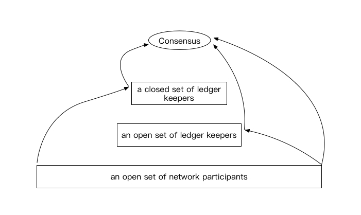

# The Essential Advantages of PoW Consensus

[@guoxbin](https://github.com/guoxbin)

With various innovative consensus mechanisms such as PoS, DPoS and PBFT emerging in the blockchain world, some people are asking “is PoW outdated?”, “what is the future of PoW?”, “is it still meaningful to do some optimization and innovation work based on PoW?”

After much research and analysis, YeeCo team believes that PoW is still the basis or the kernel of other existing consensus mechanisms and holds an irreplaceable position. Here is our analysis and thoughts on the essential advantages of PoW consensus.

## Distributed Consensus

When Satoshi Nakamoto came up with the PoW consensus, he didn’t mean to further the research on distributed consensus done by the scholars. People intend to consider that his PoW consensus provides a solution for distributed consensus in Byzantine environment, giving it an academic perspective, and we start to connect them together. 

Speaking of the distributed consensus, we have to include "FLP impossible" theorem in our discussion. "FLP impossible" theorem is come up with and proven by three scientists, Fischer, Lynch and Patterson, in their paper "Impossibility of Distributed Consensus with One Faulty Process” in 1985. The theorem concludes that there is no deterministic consensus algorithm that can solve the consistency problem in a minimum asynchronous model system that is reliable in the network but allows node failure (even if there is only one). The revelation of this theorem is that the technically workable distributed consensus must be compromised in some respects.

In fact, there are mainly 2 types of compromise; one is the compromise of asynchrony, and the other is the compromise of finality. 

The compromise of asynchrony is to set the timeout mechanism, assuming that the message will not be infinitely delayed. The DLS algorithm (“Consensus in the Presence of Partial Synchrony”) and the PBFT algorithm (“Practical Byzantine Fault Tolerance”) are examples in this. Furthermore, the DLS paper reveals two goals of asynchronous consensus in the Byzantine environment: security (consistency) and liveness (availability). Both of the examples make synchronization assumptions to ensure liveness rather than security, which means that if the real environment does not meet the synchronization hypothesis, it will only cause liveness problems rather than consistency problems. That's why we often say that PBFT is a consensus algorithm that prioritizes consistency over availability.

The compromise of finality is based on the concept introduced by Nakamoto, which is that finality is probabilistic. A probabilistically secure consensus is jointly constructed by peer-to-peer networks  through the proof of work and block rewards. It seems that on the map, the Nakamoto consensus is only one of the 2 compromise solutions of the asynchronous Byzantine consensus problem defined by consensus researchers, but the introduction of probability finality not only solves the traditional asynchronous Byzantine problem, but also solves a bigger problem. : Allows any number of nodes to participate in the system in an open manner, and they don’t have to know the complete set of the participants. It is very remarkable because this is the reality that the public chains face. In practice, the Nakamoto consensus that makes compromise on finality has achieved great success.

In essence, the innovative consensuses are also based on the 2 types of compromises. 

## The Compromises Made by Various Consensuses

### PoS:

PoS is essentially a PoW and it is a kind of compromise of finality. Staking can be regarded as a threshold. By introducing the threshold, the number of the participants is reduced. The smaller participant set size has two advantages: 1. The total workload of the entire system will be reduced, so is the energy consumption; 2. Asynchronous communication networks are smaller in scale and a fork is less likely to happen due to the delay, and block intervals can be smaller. This is why PoS says it has higher TPS and is more efficient.

### DPoS+PBFT

DPoS+PBFT is PBFT in nature and it’s a kind of compromise of asynchrony. The purpose of DPoS is to select a set of participants that can apply the PBFT algorithm. This set has to meet three conditions: 1. The scale is small enough, otherwise the traffic is huge; 2. The total number of the participants is a certain figure, so it is an asynchronous consensus problem that PBFT can solve; 3. The number of malicious participants (Byzantine nodes) is less than 1/3. The Staking mechanism plays two roles in it: 1. Screening users as a threshold; 2. As an incentive mechanism to reduce the proportion of malicious nodes.

### Tetris

Tetris is a knowledge inference based consensus algorithm innovated by YeeCo. It is essentially BFT and a kind of compromise of asynchrony. Tetris itself is a solution to the standard Byzantine problem, with a focus on its high performance and proven security. The BFT participants are selected through a pluggable upper layer protocol, which is workable in PoW, DPoS, VRF, etc.

### Algorand

Algorand is essentially a BFT, a kind of compromise of asynchrony. Algorand chooses a set of participants that can apply the BFT algorithm in a very special and ingenious way, using VRF (verifiable random function), similar to each participant owning a lottery ticket and the participant can know if he/she is selected or not without communicating with other participants. It seems to be very efficient, but there are a few limits: 1. Need to set a threshold for the participants, because the cost of creating a private key to participate in the network is very low, and in fact Algorand takes the participant’s balance into consideration; 2. As there should be a winning rate for the lottery, and the system needs to know the total number of participants whic is a consensus problem in itself. In order to infer the total number of participants, Algorand tries to make sure that the online balance is about the same as the total balance in the network by rewarding the online nodes. This is in fact a Byzantine fault tolerant system that requires that the total balance of the online and honest nodes is  over 2/3.

### DAG

DAG (Directed Acyclic Graph), adopted by IOTA and Conflux, is essentially PoW, and a compromise of finality. If the previous consensuses aim to avoid forks, then DAG’s aim is to control the fork to a certain level, thereby improving the system’s TPS. The essence of DAG is proof of work, but the principle of the longest chain has been changed to the principle of  the most difficult graph structure.

## PoW Being the Kernel or Basis

We can summarize the model of consensus: 

The difference in the various consensus mechanisms is actually the difference in the path from “an open set of network participants” to “consensus”. For example, if the path is from “an open set of network participants” directly to “consensus”, then it is PoW; if the path is from “an open set of network participants” to “an open set of ledger keepers” first and then to "consensus", then it is PoS; if the path is from “an open set of network participants” to “a closed set of ledger keepers” first and then to “consensus”, then it is X+BFT, and X may be DPoS or VRF.

We can see that there are not much innovation in these consensus mechanisms. As long as a consensus is reached from an “an open set of network participants" (nodes can join and leave freely), only one model can be adopted, Nakamoto consensus: nodes are motivated to continue to reach a consensus result based on a consensus result with probabilistic finality.

The meaning of PoW to other consensuses lies in 2 points:

1. If the consensus is constructed from “an open set of network participants” (nodes can join and leave freely), then it is essentially Nakamoto consensus, so PoW consensus is regarded as the kernel of such consensuses.

2. If the consensus is changing “an open set of network participants” to “a closed set of network participants”, then mechanism is still required in this case. Where does the consensus on the value of staking come from? The first crypto currency and the Nakamoto consensus play important roles in it. So PoW consensus plays as the basis of such consensuses. 

## The Essential Advantages of PoW

PoW supporters has listed a number of its merits, such as reliability, purity. When it comes to energy consumption, some people regard it as a flaw, while some people disagree and believe that energy cost is the basis of security.

From my point of view, the essential advantages of PoW are as follows:

### Ultimate Openness

PoW is designed for an open set of participants. This openness (the participants are unstable) is always a challenge for them to reach a consensus, whether it is during the earliest cold start, or during the mining stage when the crypto price and mining difficulty are fluctuating.

PoW has adopted an extremely simple mechanism to solve the openness problem. PoW does not need to make any patches for any of the scenarios or conduct any governance. Relying on its core mechanism to drive the entire system, it has withstood the test of time. PoW consensus design is ingenious, simple and adaptable, making it outstanding among a number of consensuses.

PoW is an absolute permissionless system. New hashrate can join the competition at any time and at the same starting line with existing hashrate. Although Staking investments seem similar to the hashrate investments, but different initial factors lead to quite different situations. If the blockchain system is a system that is easy to fall into the "Matthew effect", then in PoW the requirement of hashrate investments (external and physical) is an important factor to resist this effect. On the one hand, the lagging adjustment mechanism makes it difficult for the system to enter a steady state. On the other hand, the external and physical hashrate investments are more independent than stakings. For PoW, the positive feedback of the consensus advantage of influencing the consensus result to the business advantage is one-way, but for staking, the positive feedback is two-way.

### Ultimate Security

The frequently discussed security issues, such as 51% attack, over 1/3 Byzantine nodes, are all issues that may arise due to the consensus rules. However, the blockchain system is ultimately a system running on a physical network, so, compared with the attack that takes advantage of the consensus rules, the attack at the physical network level would be a catastrophe to the blockchain system.

PoW believes that the power of a node should not be determined by the virtual resource it holds(Staking), but should be determined by the physical resource (hashrate). 

In the case of Staking, it is easy to fall into a situation where the size of the network nodes doesn’t grow with the continuous investment of virtual resources due to the lack of driving force. The economic scale of the system and its resistance to threats from the network are not matched, and there is no internal mechanism to promote that. 

In the case of PoW, the resource investments correspond to the investments to power of influence in the network. At the initial stage, the hashrate investment is to invest more nodes. Later, with the emergence of professional mining machines and mining pools,  the hashrate and the node count do not match exactly. But since the hashrate is invested, the investors will definitely take measures to get the power of influence in the network, and the economic scale of the system and its resistance to threats from the network are matched. If virtual resources are attached more importance to when weighting the node, the difference between the power of influence in the system and that in the physical network for the nodes will be greater. As for the PoW that doesn’t take the virtual resources into consideration at all, the power of influence in the system and that in the physical network for the nodes are the same. The security of PoW is reflected here: energy cost being the basis of security is resulted from the physical network environment.

Openness and security are exactly the two angles in the “blockchain impossible triangle” (in the triangle that’s formed by Scalability, Decentralization, and Security, there are only two angels can be achieved). 

The essential advantages of PoW is that it provides a highly decentralized and secure consensus mechanism. And the one that’s left, scalability, is exactly the development and innovation direction of the PoW consensus. 