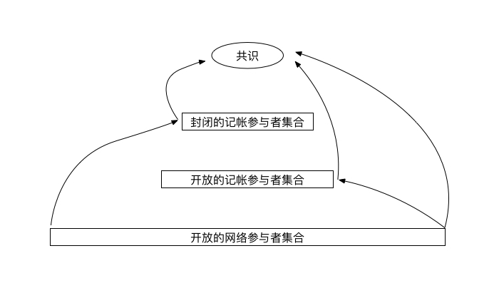

# PoW共识的本质优势

在当今充斥着各种创新共识（PoS，DPoS，PBFT）的区块链世界，PoW是不是过时了？PoW的未来是什么？是否还要基于PoW做一些共识优化和创新工作？

我们认为，PoW仍然是目前其他共识的内核或基础，有着不可取代的地位。为什么这么说？我们尝试着透视下这些共识之间的联系。

## 分布式共识
回顾下历史，中本聪的PoW并非延续自学术圈对分布式共识的研究，他最初也并不知道自己给出的一套方案是否对应与某个学术主题，只是后来，大家认为中本聪的PoW是大致上给出了拜占庭环境分布式共识的一个解决方案，我们对PoW才有了一个学术上的视角，可以把PoW研究的问题和学术上对分布式共识的研究联系起来。

说到分布式共识，不得不说"FLP不可能"定理：在网络可靠，但允许节点失效（即便只有一个）的最小化异步模型系统中，不存在一个可以解决一致性问题的确定性共识算法。提出并证明该定理的论文[《Impossibility of Distributed Consensus with One Faulty Process》](https://groups.csail.mit.edu/tds/papers/Lynch/jacm85.pdf)是由 Fischer，Lynch 和 Patterson 三位科学家于1985年发表。这个定理给我们的启示是：我们现在工程上可行的分布式共识，一定是在某些方面进行了妥协。

事实上，目前确实有两个妥协的方向，一个是对异步进行妥协，一个是对确定性进行妥协。

所谓对异步进行妥协，就是设置超时机制，认为消息不会无限延迟。DLS算法（[《部分同步存在下的共识》](https://groups.csail.mit.edu/tds/papers/Lynch/jacm88.pdf)）和PBFT算法（[实用拜占庭容错](http://pmg.csail.mit.edu/papers/osdi99.pdf)）都是这个方向的方案。更进一步，DLS论文中揭示了拜占庭环境下异步共识的两个目标：安全性（一致性）和活跃性（可用性），而这两个方案都是为活跃性做出同步假设，而不是为安全性做出同步假设，即如果真实环境不满足同步假设，只会引起可用性问题，不会引起一致性问题。这也是为什么我们经常说PBFT是一个一致性优先于可用性的共识算法。

所谓对确定性进行妥协，那就是中本聪引入的新世界，确定性是概率的。在这个方向上，通过工作量证明，区块奖励，对等网络共同构建了一个概率上安全的共识方案。看起来，在版图上，中本聪共识只是共识研究人员定义的异步拜占庭共识问题的妥协方案中的一个，但是概率确定性的引入不仅解决了传统异步拜占庭问题，而且解决了一个更大的问题：可以让任意数量的节点以开放的方式参与系统，并且任何参与者都不必知道完整的参与者集。这是非常了不起的，而且这正是公链系统真正面临的环境。在实践上，对确定性进行妥协的中本聪共识取得了巨大的成功。

而创新的公链共识机制其实也无外乎这两个妥协方向，下面分别介绍下其中的一些代表。

## 不同共识的妥协分析
### PoS：
Pos本质上还是PoW，是对确定性进行妥协。Staking可以视作参与的准入门槛，通过提高门槛，降低了参与者集的规模，更小的参与者集规模有两个好处：1. 整个系统的总工作量会降低，能耗降低；2. 异步通信网络规模更小，被延迟造成分区的可能性更小，可以设置更小的出块间隔。这也是为什么PoS说自己TPS更高且更节能。
    
### DPoS+PBFT
DPoS+PBFT本质上当然是PBFT，是对异步进行妥协。DPoS的目的是为了在开放的公链参与者中选取一个可以应用PBFT算法的参与者集合，这个集合满足三个条件：1. 规模足够小，否则通信量巨大；2. 集合总数确定，这样才是个PBFT可以解决的异步共识问题；3. 其中恶意参与者个数（拜占庭节点）小于1/3。Staking机制在其中发挥了两个作用：1. 作为门槛筛选用户；2. 作为激励机制降低恶意节点的比例。

## Tetris
Tetris是YeeCo首创的一个基于知识推理的共识算法，其本质上是BFT，是对异步进行妥协。Tetris本身是对标准的拜占庭问题的一个解决方案，重点在于其高性能，并证明了安全性。其BFT参与者集合通过可插拔的上层协议选出，PoW，DPoS，VRF等都可以。

### Algorand
Algorand本质上是BFT，是对异步进行妥协。Algorand选取可以应用BFT算法的参与者集合的方式很特殊和巧妙，利用了VRF（可验证随机函数），类似每个参与者自带一个摇奖设备，可以不通过和其他参与者通信就知道自己是否被选中，看起来是非常节能的，但这里面有几个问题要解决：1. 需要为参与者设置门槛，因为创建一个可以参与网络的私钥的成本非常低，事实上Algorand按照参与者的余额给予权重；2. 摇奖需要设置中奖率，需要知道参与者的总数量，这本身就是一个共识难题，Algorand通过对节点在线进行奖励，尽力达到在线余额和系统总余额相当的情况，从而可以反推参与者数量。这事实上是一个要求全网在线且诚实的余额>2/3的拜占庭容错系统。

### DAG
DAG（有向无环图），不论是以交易为图顶点的IOTA，还是以区块为图顶点的Conflux，都还是工作在PoW上，是对确定性进行妥协。如果说以前的共识都是在避免分叉的话，那么DAG则是要把分叉控制在一定的水平，从而提高系统的TPS。DAG本质还是工作量证明，只不过最长链原则被改成了最难图结构原则。

## PoW是内核或基础
我们大约归纳下共识的模型，如下图：

共识机制的不同的实际上是从"开放的网络参与者集合"到"共识"的路径的不同。比如，直接从"开放的网络参与者集合"到"共识"，那就是PoW；先到"开放的记帐参与者集合"再到"共识"，就是PoS；先到"封闭的记帐参与者集合"再到"共识"，那就是X+BFT，X要看到"封闭的记帐参与者集合"采取的工具的什么，可以是DPoS，也可以是VRF。

可以看出，这么多共识算法其实并没有发明太多新东西，只要是从一个"开放参与者集合"（节点自由进出）形成共识，就只能采取这种模式：节点被激励在一个具有概率确定性的共识结果的基础上继续建立共识结果，这也就是中本聪共识。

PoW对于目前创新的共识的意义在于两点：
1. 如果共识涉及到从一个"开放参与者集合"（节点自由进出）形成共识，那本质上还是中本聪共识，这就是前面说的"PoW仍然是目前其他共识的内核或基础"中的"内核"；
2. 如果共识涉及到把"开放参与者集合"变成"封闭参与者集合"，则还是需要Staking机制，试问Staking的价值共识来自哪里？还是从PoW链传递来的。这就是前面说的"PoW仍然是目前其他共识的内核或基础"中的"基础"；

## PoW的本质优势
PoW支持者给出了很多PoW的定性的优点，比如自然，可信，纯粹。而关于能耗，有人认为这是PoW的缺点，而有人认为成本代价才是安全性的基石。

下面谈一下我眼中PoW的本质优势：
### 共识开放性的极致
PoW是为开放的参与者集合设计的，这种开放性（参与者集合的不稳定性）时时刻刻都在挑战共识的达成，不论是最早期的冷启动，还是出现矿池，出现ASIC矿机，币价起伏，难度起伏。

*PoW采取了极致简单的机制解决开放性问题*。PoW不需要为任何一个场景，任何一个阶段打任何补丁，做任何治理，始终靠其最核心的机制驱动整个系统运转，经受了时间的考验。在我们的观念中，有的系统抓住了本质，巧妙而简单，适应性极强，而有的系统充斥着补偿机制，不断在随着环境的变化而改变，PoW就是前者的优秀代表。

*PoW是测底的Permissionless系统*。任何时候，算力都可以入场，和已有算力在同一个起跑线竞争。Staking投入和算力投入看起来很类似，但在博弈环境下，起点的参数差异会造成完全不同的格局。如果说区块链系统是一个容易陷入"马太效应"的系统，PoW的外部实体算力投入就是抵御这一效应的重要参数，一方面，滞后性的调节机制加大了系统进入稳态的难度；另一方面，外部实体算力相比Staking具有更好的独立性，PoW中共识优势对业务优势的正反馈是单向的，而Staking中共识优势对业务优势的正反馈是双向的。

### 共识安全性的极致
共识经常被谈及的安全性问题比如51%攻击，超过1/3拜占庭节点，都是在共识规则之下的，而区块链系统最终是一个运行在物理网络上的系统，相比起在共识规则下的作恶，物理网络层面的攻击才是对区块链系统的降维打击。

存粹的PoW认为一个节点的权重不应该由虚拟资源（Staking）决定，而应该由实体资源（算力）决定。

前者很容易陷入虚拟资源在持续投入，但是网络节点规模的增长没有足够的驱动力的情况，即这个系统的经济规模和其对来自网络的威胁的抵御能力是不匹配的，也没有内生的机制促进起匹配。

而后者的资源投入实质就对应于网络话语权的投入，最初的算力投入就是运行更多的节点的投入，后来出现了专业矿机和矿池，才出现了算力和节点不完全匹配的情况，但是投资算力的人既然投入了，就一定会采取措施拿到对应的网络话语权，系统的经济规模和其对来自网络的威胁的抵御能力是相匹配的。节点权重考虑虚拟资源越多，节点在系统中的话语权和在物理网络中的话语权的差异就越大，而不考虑虚拟资源的PoW，节点在系统中的话语权和在物理网络中的话语权是一致的。PoW的安全性正是体现在此，成本代价支撑安全性的根源在于物理网络环境。

"共识开放性"和"共识安全性"是不是看起来很眼熟，他们正是"区块链不可能三角"（即无法同时达到可扩展性（Scalability）、去中心化（Decentralization）、安全（Security），三者只能得其二）中的两角，

PoW的本质优势就是真正提供了一套高度去中心化，高度安全的共识机制。而可扩展性，正是PoW共识需要发展和创新的方向。